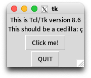

% GPAW

SQUIDに第一原理計算コードGPAWをインストールする方法を説明する。

## 環境設定

LibxcやGPAWのコンパイルで必要なコンパイラを読み込む。

初期設定では何も読み込まれていない。

~~~{.console}
$ module list
No Modulefiles Currently Loaded.
~~~

```module avail```で利用できるモジュールを確認する。

~~~{.console}
$ module avail
----------------------------------------------- /system/apps/env/Base -----------------------------------------------
BaseApp/2021           BaseExtra/2023           BaseGPU/2025(default)    BasePy/2022
BaseApp/2022           BaseExtra/2024           BaseJDK/2021             BasePy/2023
BaseApp/2023           BaseExtra/2025(default)  BaseJDK/2022             BasePy/2024
BaseApp/2024           BaseGCC/2021             BaseJDK/2023             BasePy/2025(default)
BaseApp/2025(default)  BaseGCC/2022             BaseJDK/2024             BaseR/2021
BaseCPU/2021           BaseGCC/2023             BaseJDK/2025(default)    BaseR/2022
BaseCPU/2022           BaseGCC/2024             BaseJulia/2021           BaseR/2023
BaseCPU/2023           BaseGCC/2025(default)    BaseJulia/2022           BaseR/2024
BaseCPU/2024           BaseGPU/2021             BaseJulia/2023           BaseR/2025(default)
BaseCPU/2025(default)  BaseGPU/2022             BaseJulia/2024           BaseVEC/2023
BaseExtra/2021         BaseGPU/2023             BaseJulia/2025(default)  BaseVEC/2024
BaseExtra/2022         BaseGPU/2024             BasePy/2021              BaseVEC/2025(default)
~~~

```BaseCPU/2022```を読み込む。

~~~{.console}
$ module load BaseCPU/2022
Loading compiler version 2023.0.0
...
$ module list
Currently Loaded Modulefiles:
 1) inteloneAPI/2023.0   5) compiler/latest   9) dal/latest                13) mkl/latest       17) BaseCPU/2022
 2) tbb/latest           6) mpi/latest       10) inspector/latest          14) vtune/latest
 3) compiler-rt/latest   7) advisor/latest   11) intel_ipp_intel64/latest  15) debugger/latest
 4) oclfpga/latest       8) clck/latest      12) itac/latest               16) dpl/latest
~~~

## Libxc

交換相関汎関数ライブラリをインストールする。

Libxcのソースコードを```~/src/lib```にダウンロードして展開する。

~~~{.console}
$ cd
$ mkdir src lib
$ cd src
$ wget https://gitlab.com/libxc/libxc/-/archive/4.3.4/libxc-4.3.4.tar.bz2
$ ls
libxc-4.3.4.tar.bz2
$ tar jxvf libxc-4.3.4.tar.bz2
~~~

Libxcを```~/src/libxc-4.3.4```でコンパイルし、```~/lib/libxc-4.3.4```にインストールする。

~~~{.console}
$ cd libxc-4.3.4
$ autoreconf -i
$ ./configure CC=icc CFLAG="-O2 -fPIC" --enable-shared --disable-fortran --prefix=/sqfs/home/ユーザ名/lib/libxc-4.3.4
$ make
$ make check
make[4]: ディレクトリ '/sqfs2/cmc/0/home/ユーザ名/src/libxc-4.3.4/testsuite' に入ります
~~~

```make check```でフリーズするのでCtrl+Cで止める。

~~~{.console}
$ make install
~~~

## Sqlite3

Pythonのインストールで必要になるSqlite3をインストールする。

Sqlite3のソースコードを```~/local/src```にダウンロードして展開する。

~~~{.console}
$ cd ~
$ mkdir -p local/src
$ cd local/src
$ wget https://www.sqlite.org/2024/sqlite-autoconf-3450200.tar.gz
$ tar xzvf sqlite-autoconf-3450200.tar.gz
~~~

Sqlite3を```~/local/src/sqlite-autoconf-3450200```でコンパイルし、```~/local```にインストールする。

~~~{.console}
$ cd sqlite-autoconf-3450200
$ ./configure --prefix=$HOME/local
$ make -j4
$ make install
~~~

## Tcl/Tk

Pythonのインストールで必要になるTcl/Tkをインストールする。

Tclのソースコードを```~/local/src```にダウンロードして展開する。

~~~{.console}
$ cd ~/local/src
$ wget https://prdownloads.sourceforge.net/tcl/tcl8.6.13-src.tar.gz
$ tar xzvf tcl8.6.13-src.tar.gz
~~~

Tclを```~/local/src/tcl8.6.13/unix```でコンパイルし、```~/local```にインストールする。

~~~{.console}
$ cd tcl8.6.13/unix
$ ./configure --prefix=$HOME/local
$ make -j4
$ make install
~~~

Tclと同じバージョンのTkのソースコードを```~/local/src```にダウンロードして展開する。

~~~{.console}
$ cd ~/local/src
$ wget https://prdownloads.sourceforge.net/tcl/tk8.6.13-src.tar.gz
$ tar xzvf tk8.6.13-src.tar.gz
~~~

Tkを```~/local/src/tk8.6.13/unix```でコンパイルし、```~/local```にインストールする。

~~~{.console}
$ cd tk8.6.13/unix
$ ./configure --prefix=$HOME/local --with-tcl=$HOME/local/lib
$ make -j4
$ make install
~~~

## Pyenv

Pythonのバージョン管理に必要なPyenvをインストールする。

SQUIDのPythonのバージョンを確認する。

~~~{.console}
$ python3 -V
Python 3.6.8
~~~

Pyenvをインストールする。

~~~{.console}
$ git clone https://github.com/pyenv/pyenv.git ~/.pyenv
~~~

以下を```~/.bashrc```に追記する。

~~~{.prettyprint}
export PYENV_ROOT=$HOME/.pyenv
export PATH=$PYENV_ROOT/bin:$PATH
if command -v pyenv 1>/dev/null 2>&1; then
  eval "$(pyenv init -)"
fi
~~~

```~/.bashrc```を読み込んでPyenvを使えるようにする。

~~~{.console}
$ source ~/.bashrc
~~~

## Python

GPAWで用いるPyshon 3.8をPyenvでインストールする。

~~~{.console}
$ export LD_LIBRARY_PATH="$HOME/local/lib:$LD_LIBRARY_PATH"
$ export LDFLAGS="-L$HOME/local/lib"
$ export CPPFLAGS="-I$HOME/local/include"
$ export PKG_CONFIG_PATH="$HOME/local/lib/pkgconfig"
$ PYTHON_CONFIGURE_OPTS="--with-tcltk-includes='-I$HOME/local/include' --with-tcltk-libs='-L$HOME/local/lib'" pyenv install 3.8
Downloading Python-3.8.20.tar.xz...
...
~~~

Pythonのバージョンを3.8.20に設定する。

~~~{.console}
$ pyenv versions
* system (set by /sqfs/home/ユーザ名/.pyenv/version)
  3.8.20
$ pyenv global 3.8.20
$ pyenv versions
  system (set by /sqfs/home/ユーザ名/.pyenv/version)
* 3.8.20
$ python -V
Python 3.8.20
~~~

Tcl/TkがPythonに組み込まれていたら、テスト用のウィンドウが表示できる。

~~~{.console}
$ python -m tkinter
~~~

<div style="text-align: center;">

</div>

## Pythonライブラリ

GPAWの実行に必要なPythonライブラリをインストールする。

以下を```~/requirements.txt```に保存する。

~~~{.console}
ase==3.20.1
attrs==20.3.0
cycler==0.10.0
cymem==2.0.5
Cython==0.29.21
decorator==4.4.2
iniconfig==1.1.1
kiwisolver==1.3.1
matplotlib==3.3.3
mpi4py==3.0.3
numpy==1.19.5
packaging==20.8
Pillow==8.1.0
pluggy==0.13.1
py==1.10.0
pyparsing==2.4.7
pytest==6.2.1
python-dateutil==2.8.1
scipy==1.5.4
setuptools==41.2.0
six==1.15.0
toml==0.10.2
~~~

仮想環境を```py38env```を作って有効化する。

~~~{.console}
$ cd
$ python -m venv py38env
$ source ~/py38env/bin/activate
~~~

```~/requirements.txt```に書かれたライブラリを仮想環境にインストールする。

~~~{.console}
(...) $ pip install --upgrade pip
(...) $ pip install -r requirements.txt
(...) $ pip list
Package             Version
--------------- -------
ase             3.20.1
attrs           20.3.0
cycler          0.10.0
cymem           2.0.5
Cython          0.29.21
decorator       4.4.2
iniconfig       1.1.1
kiwisolver      1.3.1
matplotlib      3.3.3
mpi4py          3.0.3
numpy           1.19.5
packaging       20.8
Pillow          8.1.0
pip             25.0.1
pluggy          0.13.1
py              1.10.0
pyparsing       2.4.7
pytest          6.2.1
python-dateutil 2.8.1
scipy           1.5.4
setuptools      41.2.0
six             1.15.0
toml            0.10.2
~~~

仮想環境を消去するには```~/py38env```を削除すればよい。

## GPAW

GPAWをSQUIDに最適化するためにソースコードからインストールする。

GPAW 20.10.0のソースコードを```~/GPAW/src```にダウンロードして展開する。

~~~{.console}
(...) $ mkdir -p ~/GPAW/src
(...) $ cd ~/GPAW/src
(...) $ wget https://pypi.org/packages/source/g/gpaw/gpaw-20.10.0.tar.gz
(...) $ tar xzvf gpaw-20.10.0.tar.gz
~~~

手元のPCから```siteconfig_20250719.py```を```~/GPAW/src/gpaw-20.10.0```にアップロードする。

~~~{.console}
$ scp siteconfig_20250719.py ユーザ名@squidhpc.hpc.cmc.osaka-u.ac.jp:~/GPAW/src/gpaw-20.10.0
~~~

```siteconfig_20250719.py```へのリンク```siteconfig.py```を作り、GPAWをインストールする。

~~~{.console}
(...) $ cd gpaw-20.10.0
(...) $ ln -fs siteconfig_20250719.py siteconfig.py
(...) $ python setup.py build
(...) $ python setup.py install
~~~

`pip`で`gpaw`が表示されるようになる。

~~~{.console}
(...) $ pip list
...
gpaw            20.10.0
...
(...) $ pip show gpaw
Name: gpaw
Version: 20.10.0
Summary: GPAW: DFT and beyond within the projector-augmented wave method
Home-page: https://wiki.fysik.dtu.dk/gpaw
Author:
Author-email:
License: GPLv3+
Location: /sqfs2/cmc/0/home/ユーザ名/py38env/lib/python3.8/site-packages
Requires: ase
Required-by:
~~~

## 設定データ

PAWの設定データをインストールする。

```gpaw-setups-0.9.20000```を```~/lib```にインストールする。

~~~{.console}
$ gpaw install-data --version=0.9.20000 ~/lib
Available setups and pseudopotentials
      https://wiki.fysik.dtu.dk/gpaw-files/gpaw-setups-24.11.0.tar.gz
      https://wiki.fysik.dtu.dk/gpaw-files/gpaw-setups-24.1.0.tar.gz
  [*] https://wiki.fysik.dtu.dk/gpaw-files/gpaw-setups-0.9.20000.tar.gz
      https://wiki.fysik.dtu.dk/gpaw-files/gpaw-setups-0.9.11271.tar.gz
      https://wiki.fysik.dtu.dk/gpaw-files/gpaw-setups-0.9.9672.tar.gz
      https://wiki.fysik.dtu.dk/gpaw-files/gpaw-setups-0.8.7929.tar.gz
      https://wiki.fysik.dtu.dk/gpaw-files/gpaw-setups-0.6.6300.tar.gz
      https://wiki.fysik.dtu.dk/gpaw-files/gpaw-setups-0.5.3574.tar.gz

Selected gpaw-setups-0.9.20000.tar.gz.  Downloading...
Extracting tarball into /sqfs/home/ユーザ名/lib
Setups installed into /sqfs/home/ユーザ名/lib/gpaw-setups-0.9.20000.
Register this setup path in /sqfs/home/ユーザ名/.gpaw/rc.py? [y/n] y
Setup path registered in /sqfs/home/ユーザ名/.gpaw/rc.py.
Current GPAW setup paths in order of search priority:
   1. /sqfs/home/ユーザ名/lib/gpaw-setups-0.9.20000
Installation complete.
~~~

## テスト計算

GPAWが正常に動作するか確認する。

以下のジョブスクリプトを```~/GPAW/src/gpaw-20.10.0/run.sh```に保存する。

~~~{.prettyprint}
#!/bin/bash
#------- qsub option -----------
#PBS -q SQUID
#PBS --group=グループ名
#PBS -m b
#PBS -l cpunum_job=76
#PBS -l elapstim_req=1:00:00
#------- Program execution -----------
module load BaseCPU/2022 #ベース環境をロードします
cd $PBS_O_WORKDIR        #qsub実行時のカレントディレクトリへ移動
~/py38env/bin/pytest -v > pytest.log
~~~

ジョブをsubmitしてGPAWのテスト計算を実行する。

~~~{.console}
$ qsub run.sh
$ tail -f pytest.log
============================= test session starts ==============================
platform linux -- Python 3.8.20, pytest-6.2.1, py-1.10.0, pluggy-0.13.1 -- /sqfs2/cmc/0/home/ユーザ名/py38env/bin/pytho
n
cachedir: .pytest_cache
rootdir: /sqfs2/cmc/0/home/ユーザ名/GPAW/src/gpaw-20.10.0
collecting ... collected 402 items

gpaw/test/test_AA_enthalpy.py::test_exx_AA_enthalpy SKIPPED (world.s...) [  0%]
...
gpaw/test/xc/test_xcatom.py::test_xc_xcatom PASSED                       [100%]

=============================== warnings summary ===============================
...

-- Docs: https://docs.pytest.org/en/stable/warnings.html
================================ GPAW-MPI stuff ================================
size: 1
==== 366 passed, 35 skipped, 1 xfailed, 107 warnings in 2397.42s (0:39:57) =====
~~~


