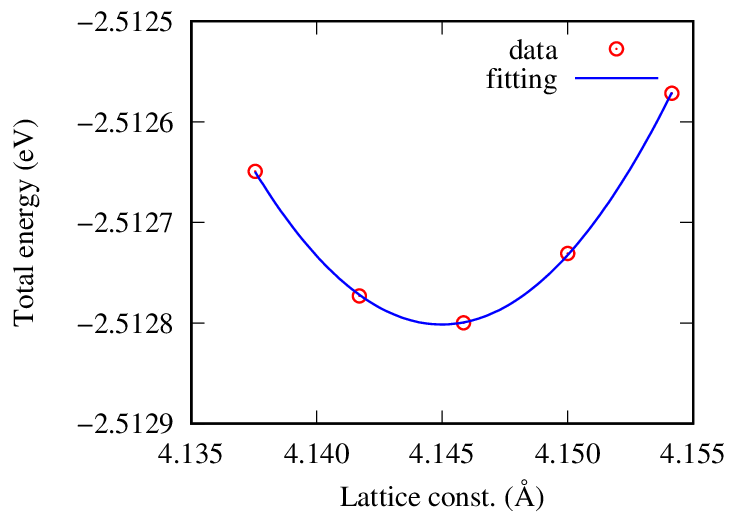

% 格子定数

[SQUID](squid.html)にインストールした[GPAW](gpaw.html)で格子定数を計算する方法を説明する。

## 計算条件
- Agの面心立方格子
- LCAOのdzp基底
- PBE交換相関汎関数
- 16x16x16k点サンプリング

## サンプルスクリプト

次のスクリプトを`input.py`に保存する。

格子定数の目安を4.15 Åとして99%〜101%の範囲で変化させる。

~~~{.prettyprint}
from ase.build import bulk
from gpaw import GPAW, MethfesselPaxton, Mixer
from ase.io import Trajectory
from gpaw.utilities import h2gpts
from gpaw import extra_parameters
extra_parameters['blacs'] = True
import numpy as np

a0 = 4.15
traj = Trajectory('ag.traj', 'w')

for eps in np.linspace(-0.01, 0.01, 21):
    a = (1 + eps) * a0
    ag = bulk('Ag', 'fcc', a=a)
    ag.calc = GPAW(mode='lcao', basis='dzp', xc='PBE',
               occupations=MethfesselPaxton(0.05, order=1), maxiter=999,
               mixer=Mixer(nmaxold=5, beta=0.05, weight=75),
               nbands=10, kpts=(16, 16, 16), txt = 'eval_eps%.3f.txt' % eps)

    ag.get_potential_energy()
    traj.write(ag)
~~~

### 参考

- [Finding lattice constants using EOS and the stress tensor](https://wiki.fysik.dtu.dk/ase/tutorials/lattice_constant.html)

## ジョブスクリプト

次のスクリプトを`run.sh`に保存する。

~~~{.prettyprint}
#!/bin/bash
#------- qsub option -----------
#PBS -q SQUID
#PBS --group=グループ名
#PBS -m be
#PBS -M メールアドレス
#PBS -l cpunum_job=76
#PBS -l elapstim_req=1:00:00
#PBS -N AgBulkLCAO
#PBS -T intmpi
#PBS -v OMP_NUM_THREADS=1
#------- Program execution -----------
module load BaseCPU/2022
cd $PBS_O_WORKDIR
mpirun ${NQSV_MPIOPTS} -np 64 /sqfs2/cmc/0/home/ユーザ名/py38env/bin/python input.py
~~~

ジョブを投入する。

~~~{.console}
$ qsub run.sh
~~~

## 格子定数の計算

次のスクリプトを`lattice_const.py`に保存する。

~~~{.prettyprint}
import sys
from ase.io import read

filename = sys.argv[1]
traj = read(filename, index=':')

for atoms in traj:
    lc = atoms.cell[0][1] * 2
    energy = atoms.get_potential_energy()
    print(f'{lc:20.12f}{energy:20.12f}')
~~~

`ag.traj`から格子定数とエネルギーを抜き出して`lc.dat`に書き出す。

~~~{.console}
$ source ~/py38env/bin/activate
(...) $ python lattice_const.py ag.traj > lc.dat
~~~

最小値の近傍の5点を`lc5.dat`に保存して二次関数でフィットする。

~~~{.console}
$ gnuplot
gnuplot> f(x)=a*x*x+b*x+c
gnuplot> fit f(x) "lc5.dat" via a,b,c
...
Final set of parameters            Asymptotic Standard Error
=======================            ==========================
a               = 2.7434           +/- 0.02527      (0.9212%)
b               = -22.7427         +/- 0.2096       (0.9214%)
c               = 44.6212          +/- 0.4344       (0.9735%)
...
gnuplot> print -b/2/a
4.14498365156092
~~~

