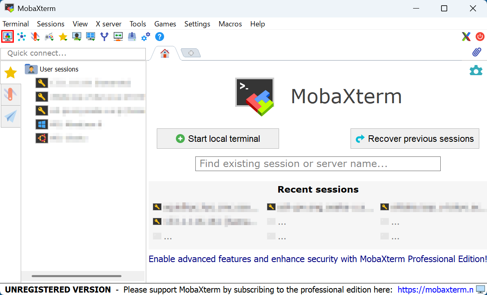
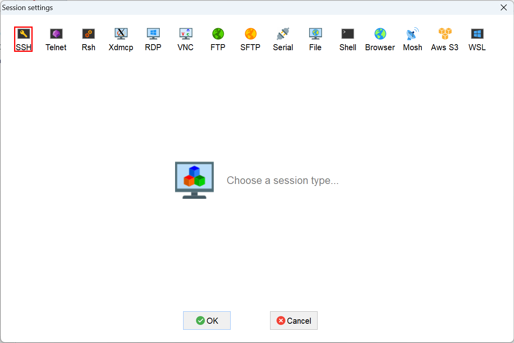
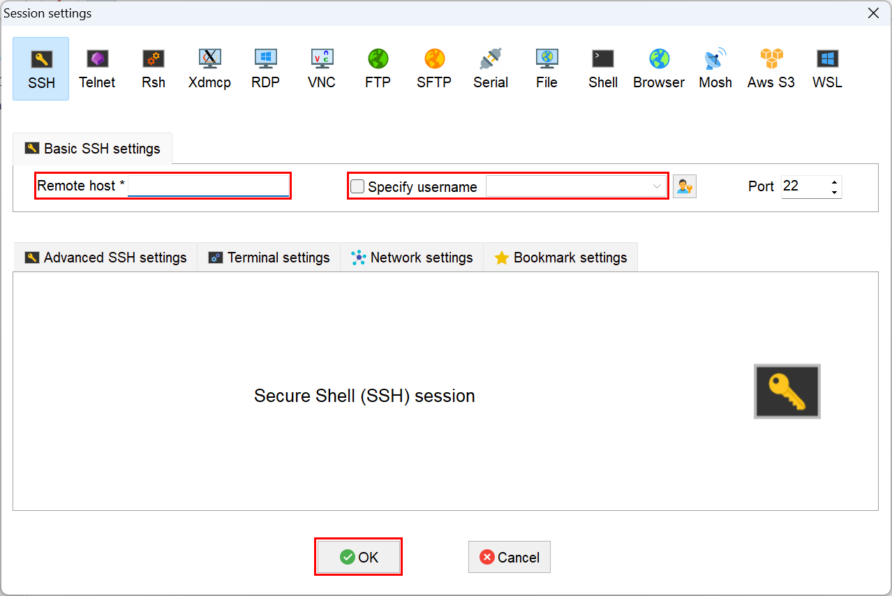
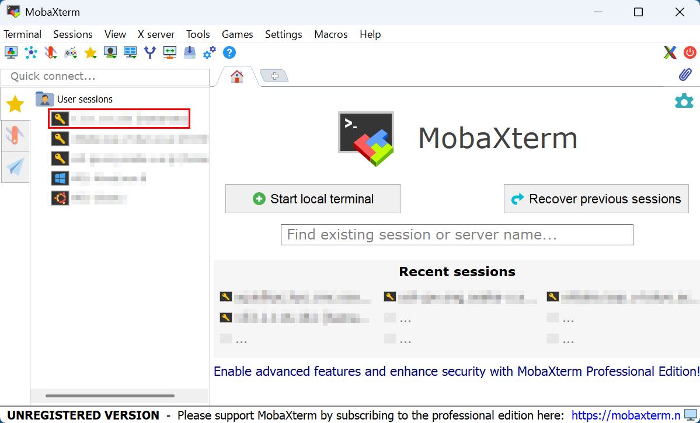
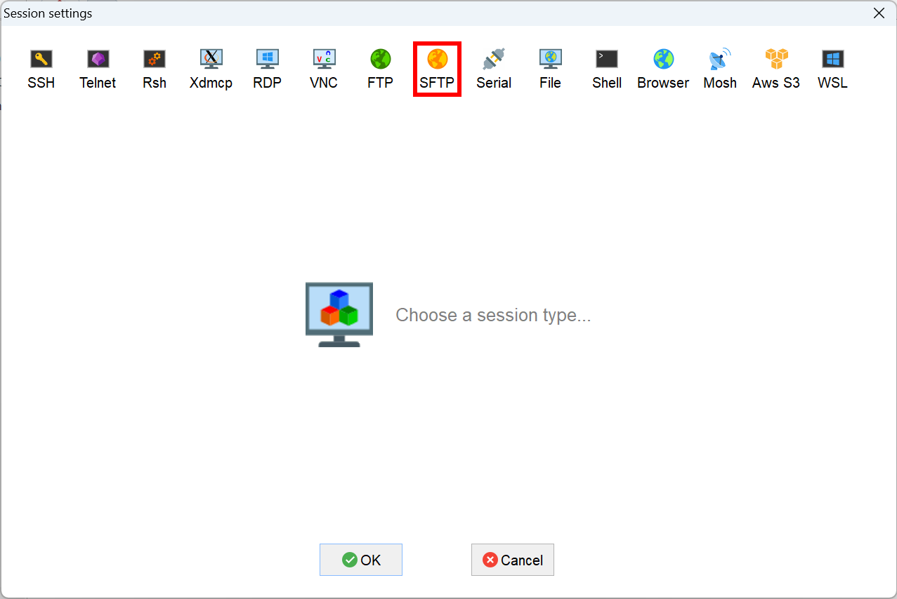
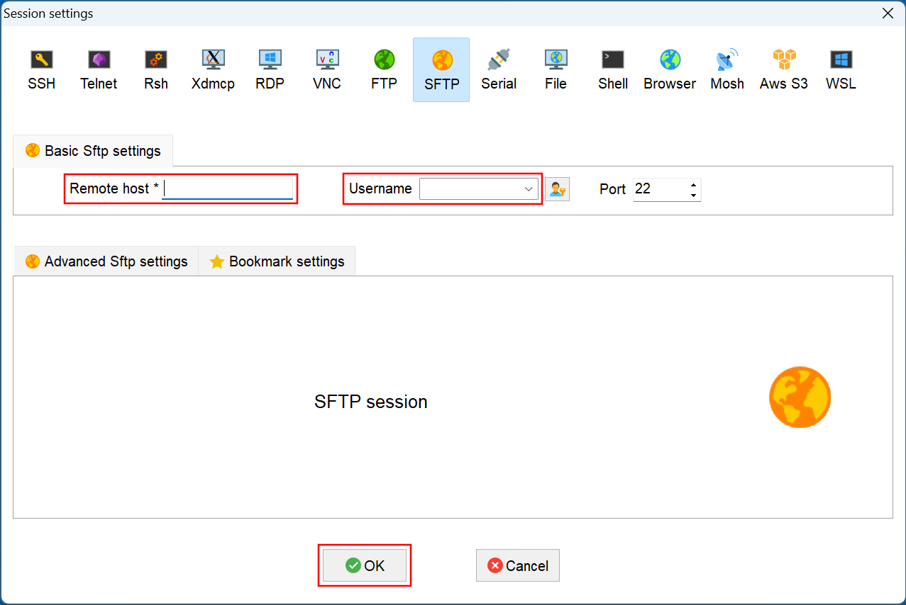
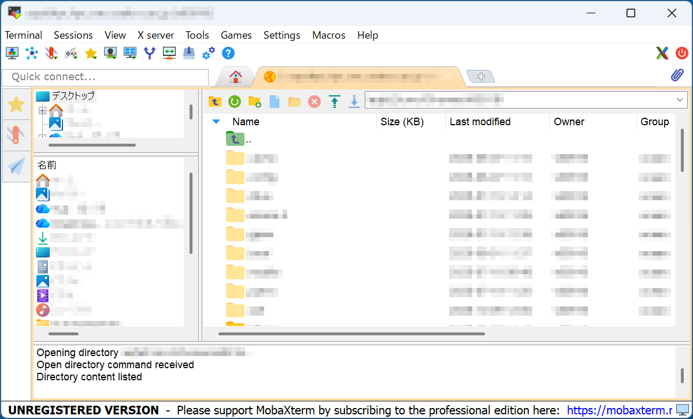

% MobaXterm

WindowsでX-Windowが使える端末エミュレータMobaXtermの使い方を説明する。

## SSHでリモートホストにログイン

1. 左上のNew sessionボタンを押す
   
   

2. 左上のSSHボタンを押す
   
   

3. Remote hostにホスト名(SQUIDなら```squidhpc.hpc.cmc.osaka-u.ac.jp```)を入力し、Specify usernameにチェックを入れてユーザ名を入力し、下のOKボタンを押す
   
   
   
4. 次回以降は左のUser sessionsから選択してログイン

   

## SFTPでリモートホストにファイル転送

1. 左上のNew sessionボタンを押す
   
   

2. 真ん中上部のSFTPボタンを押す
   
   

3. Remote hostにホスト名を入力し、Specify usernameにチェックを入れてユーザ名を入力し、下のOKボタンを押す

   
   
4. 左ペインと右ペインの間でファイルをDrag & Dropして送受信

   
